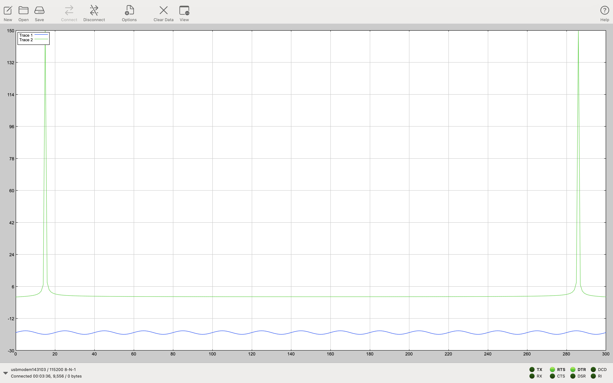

# DFT_Algorithm

This project is designed for the STM32L476 microcontroller and focuses on the computation of the Discrete Fourier Transform (DFT) for a sinus wave 5 Hz signal(genereting by Matlab).

